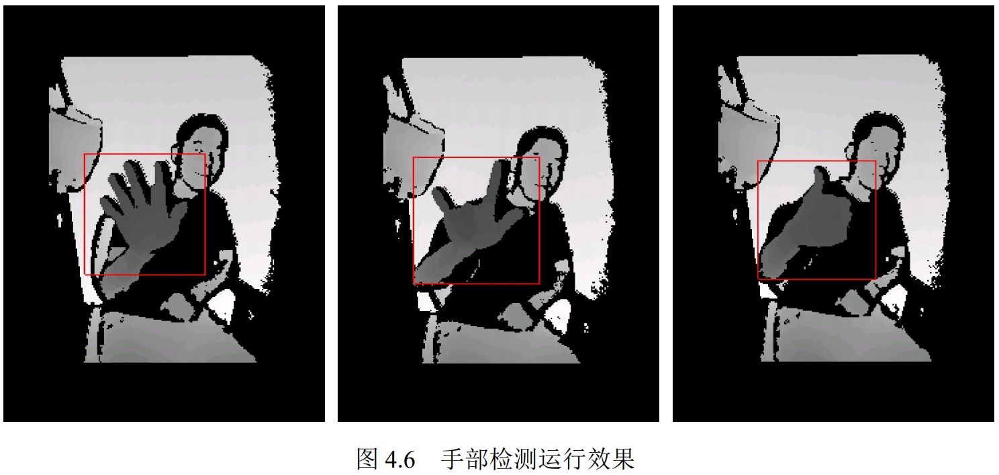
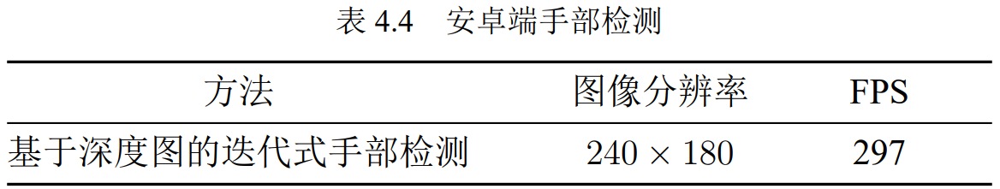
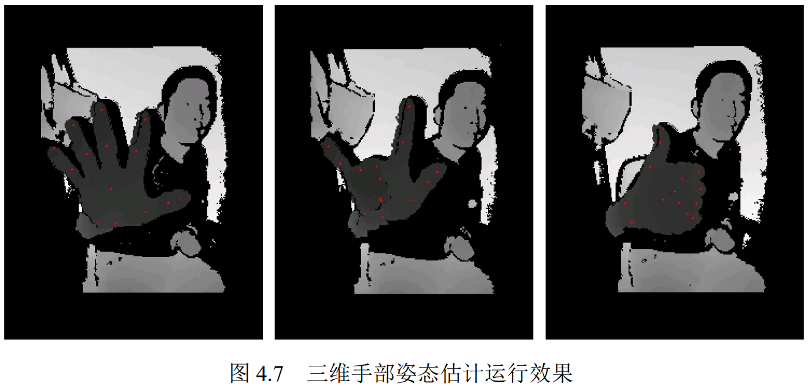
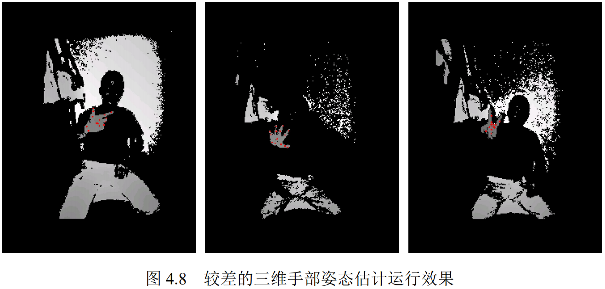
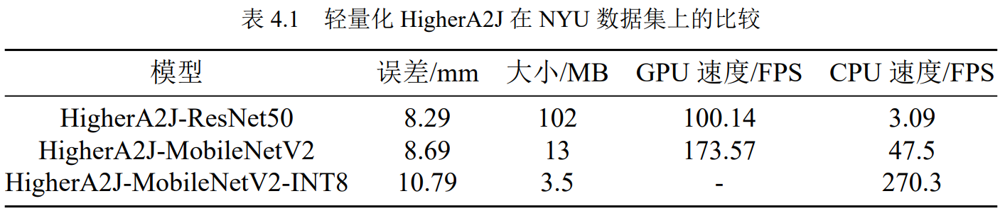
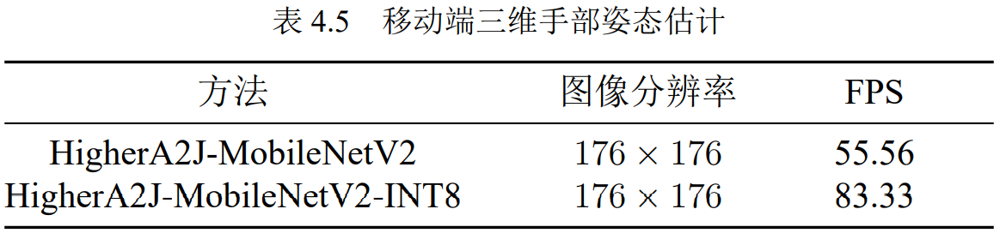

## 前言

在移动端实现三维手部姿态估计，有利于在更多的场景下实现手势交互。然而基于深度学习的三维手部姿态估计方案通常需要使用一个体积大、计算量大的网络模型，移动端通常没有足够的存储空间，也没有高性能 GPU，难以达到实时性的要求，影响用户体验。

为了解决以上问题，研究人员提出了轻量化模型，模型压缩等办法。本章利用MobileNet v2 作为 HigherA2J 的骨干网络，在保证准确度的同时尽量降低模型计算量。另外移动端前向框架也发展迅速，不仅方便开发者快速在移动端部署深度学习模型，而且前向框架对模型进行优化，提高模型在移动端的运行速度。本章实现了一个在移动端运行的三维手部姿态估计应用，主要工作和贡献有以下几点：

(1) 使用轻量化网络 MobileNet v2 作为 HigherA2J 的骨干网络，提出了 HigherA2JMobileNetV2 模型；

(2) 在移动端实现实时手部检测；

(3) 将 HigherA2J­MobileNetV2­INT8 部署到移动端，实现三维手部姿态估计。

如果应用模型量化技术，应该可以实现实时的三维手部姿态估计。

演示视频：https://www.bilibili.com/video/BV1zw411o7SS/

## 前提条件

该项目基于深度图，所以移动设备必须带有深度摄像头，本项目使用的设备是带有TOF摄像头的荣耀V20。

## 实现效果

## 致谢

该项目基于稚晖君的DeepVision框架(https://github.com/peng-zhihui/DeepVision)